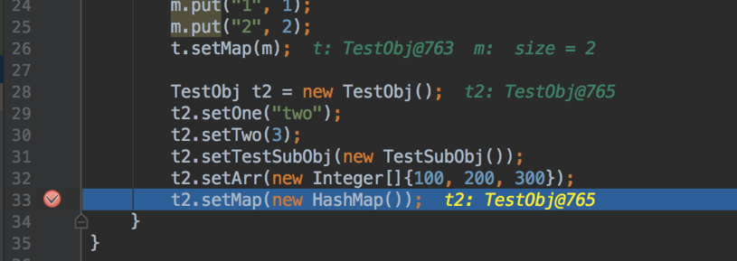

# AutoMock

Allows you to take a snapshot of the existing environment - for those who are awful at true TDD. What this allows you to do
is either add a line of code that takes a snapshot, or add a breakpoint and evaluate the expression - and AutoMock will
recreate your current environment with the parameters passed in.

## Getting Started

Either copy the AutoMock and MockObject classes into your file and use them as you would code - or just build the jar
with Maven. Or just download [this](AutoMock-0.0.1.jar) jar and add it to your classpath.

### Usage

1. You can just add a new AutoMock when you're running. An example is in TestSnapshot.java in the test folder:

```
TestObj t = new TestObj();
t.setOne("one");
t.setTwo(2);
t.setTestSubObj(new TestSubObj());
t.setArr(new Integer[]{1, 2, 3});
Map m = new HashMap<>();
m.put("1", 1);
m.put("2", 2);
t.setMap(m);

TestObj t2 = new TestObj();
...
new AutoMock(t, t2);
```

2. Or you can add a breakpoint into your code and evaluate the expression:



